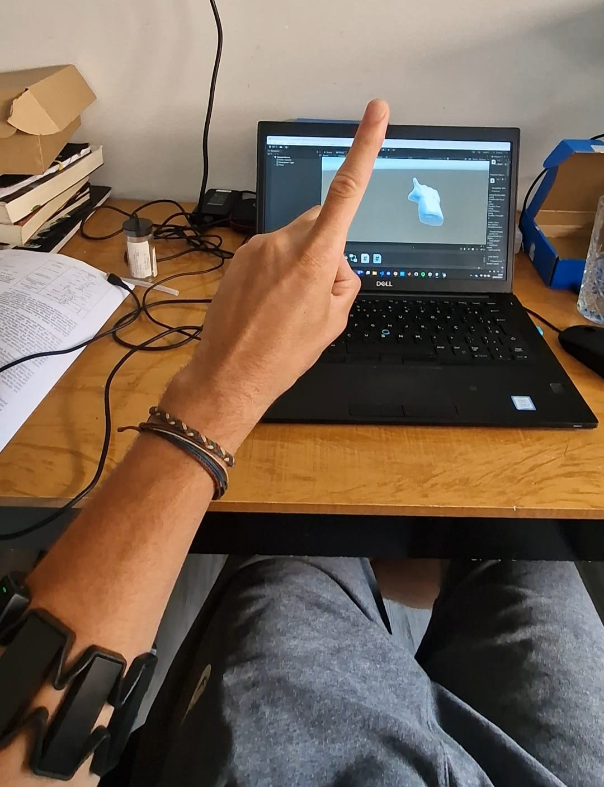

# MyoClassifier

## Overview
MyoClassifier is a project designed to acquire EMG signals from the Myo Armband and classify hand gestures in real time using various machine learning techniques. Built extensively on the Pyomyo library for signal acquisition and processing, the system translates muscle activity into precise gesture predictions. These predictions control a 3D hand model in Unity, replicating the user's movements. Additionally, the system collects and processes IMU data from the Myo Armband to accurately track and adjust the 3D hand's orientation.

<p align="center">
  
</p>


## Project Structure
The project is organized into the following directories and files:

- **data/**: Contains the datasets used for training and testing the models.
- **notebooks/**: Jupyter notebooks for data exploration, preprocessing, and model training.
- **src/**: Source code for the project, including data processing, feature extraction, and model implementation.
  - **data_processing/**: Scripts for loading and preprocessing the EMG data.
  - **feature_extraction/**: Scripts for extracting features from the EMG signals.
  - **models/**: Implementation of various machine learning models used for classification.
  - **utils/**: Utility functions and helper scripts.
  - **examples/**: Example scripts and notebooks adapted from the [`pyomyo`](https://github.com/akshaybahadur21/pyomyo) repository to demonstrate usage and integration.
- **tests/**: Unit tests for the project's codebase.
- **README.md**: Project documentation and overview.

## Getting Started
To get started with the MyoClassifier project, follow these steps:

1. **Clone the repository**:
   ```bash
   git clone https://github.com/yourusername/MyoClassifier.git
   cd MyoClassifier
   ```

2. **Install dependencies**:
   ```bash
   pip install -r requirements.txt
   ```

3. **Run the notebooks**:
   Open the Jupyter notebooks in the `notebooks/` directory to explore the data and train the models.

4. **Run the tests**:
   ```bash
   pytest tests/
   ```

## Usage
The main scripts for data processing, feature extraction, and model training can be found in the `src/` directory. You can run these scripts individually or integrate them into your own workflow.

## Unity Project
You can download the Unity project from the following link:
[Unity Project Download](https://drive.google.com/file/d/11xFDDMwNdO0Dge3Cj2RfmiCvqYhKNMiJ/view?usp=sharing)

## Contributing
Contributions are welcome! Please feel free to submit a pull request or open an issue if you have any suggestions or improvements.

## License
This project is licensed under the MIT License. See the [LICENSE](LICENSE) file for more details.
