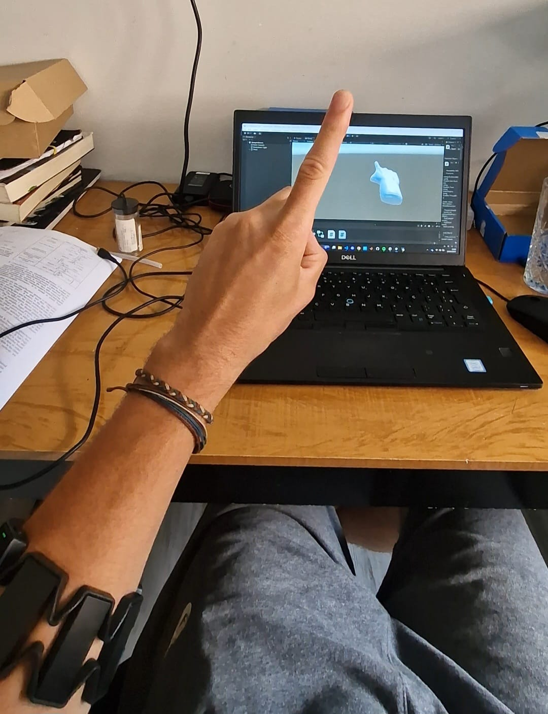
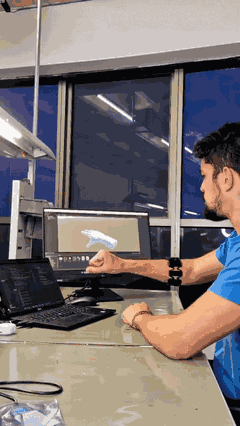

# MyoClassifier

Real-time hand gesture recognition from EMG signals, streamed straight into a 3D hand that mirrors your movement.

<p align="center">
  
</p>

MyoClassifier reads muscle activity from a **Myo Armband**, classifies it into hand gestures with machine learning, and drives a **3D hand model** that reproduces your movement live — orientation from the armband's IMU, pose from the classifier. Signal acquisition is built on [`pyomyo`](https://github.com/akshaybahadur21/pyomyo).

## Demo

<p align="center">
  
</p>

## How it works

```
Myo Armband  --EMG + IMU-->  feed.py (pyomyo, 1-NN classifier)  --gesture + orientation-->  3D hand
```

The 3D hand used to be a Unity build; it's now [`hand3d/`](hand3d/), a browser/desktop renderer built on three.js — no editor, no build, one command:

```bash
cd hand3d
python run.py
```

See [`hand3d/README.md`](hand3d/README.md) for the full breakdown (browser mode, desktop/no-browser mode, simulation mode without a Myo, and the protocol it speaks).

## Project Structure

- **[hand3d/](hand3d/)** — the current 3D hand renderer (browser + desktop), and the bridge that feeds it live gesture/orientation data.
- **[src/](src/)** — core pipeline: EMG data processing, feature extraction, and the classifiers.
  - **[src/data/](src/data/)** — recorded EMG training samples.
  - **[src/emgGestureTrainer.py](src/emgGestureTrainer.py)** — record new gesture samples from the armband.
  - **[src/myoControlsHand.py](src/myoControlsHand.py)** — the original Myo → Unity control script (superseded by `hand3d/bridge.py`, still compatible with it).
- **[examples/](examples/)** — scripts adapted from [`pyomyo`](https://github.com/akshaybahadur21/pyomyo) demonstrating raw usage: EMG/IMU streaming, live classifiers, multithreading.
- **[myTry/](myTry/)** — experiments with feature extraction and a trained k-NN classifier.

## Getting Started

1. **Clone the repository**
   ```bash
   git clone https://github.com/yourusername/MyoClassifier.git
   cd MyoClassifier
   ```

2. **Install dependencies**
   ```bash
   pip install -r requirements.txt
   ```

3. **Run the 3D hand demo**
   ```bash
   cd hand3d
   python run.py
   ```
   No Myo on hand? `python run.py --sim` fakes the gesture and orientation so you can try the renderer on its own.

4. **Train your own gestures**

   The bundled classifier only has training data for 3 of its 4 gestures (see [`hand3d/README.md`](hand3d/README.md#-one-gesture-is-missing-training-data)). Record more with:
   ```bash
   python src/emgGestureTrainer.py
   ```

## Legacy: the Unity project

The original renderer was a Unity scene driven over TCP by `src/myoControlsHand.py`. `hand3d/bridge.py` speaks the exact same protocol on the same port, so that script still works unchanged if you'd rather use Unity: [Unity Project Download](https://drive.google.com/file/d/11xFDDMwNdO0Dge3Cj2RfmiCvqYhKNMiJ/view?usp=sharing).

## Contributing

Contributions are welcome! Please feel free to submit a pull request or open an issue if you have any suggestions or improvements.

## License

This project is licensed under the MIT License.
