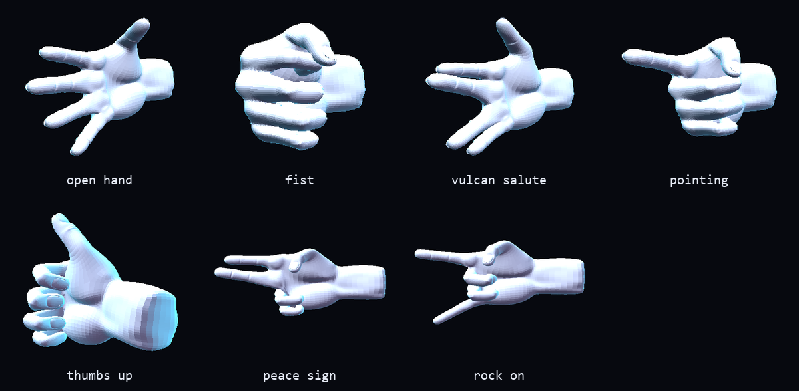

# hand3d — the 3D hand in the browser, no Unity

The same `handAnimations.fbx` the Unity project used, rendered with
[three.js](https://threejs.org) and animated by the Myo's classification. Runs
in a browser tab: no editor to open, no Play to hit, no window that needs
focus.

```bash
cd hand3d
python run.py
```

One command brings up the bridge, reads the armband, and opens the page.
`Ctrl+C` tears everything down.

---

## What replaced what

| Unity (`3DORientaion_test/`) | now |
|---|---|
| `myListener.cs` — TCP server on 25001 → `transform.rotation` | `bridge.py` → WebSocket → `pivot.rotation` in `web/hand.js` |
| `handController.cs` — `Animator` with a Grip × Trigger blend tree | `AnimationMixer` with one weight per clip |
| gesture via **emulated keypress** (`Input.GetKeyDown`, the `keyboard` lib) | `gesture` field in the JSON |
| editor + build + a window that needs focus | one browser tab |

The detail that made this simple: the FBX carries the four poses (`Relaxed`,
`fist`, `spock`, `Pointing`) as **single-frame clips**. A single-frame clip is
exactly what a blend tree mixes — so the smooth transition between gestures
comes from interpolating a weight, not from a recorded animation.

`keyboard.press()` was the most fragile part of the old setup: it only worked
with the Unity window focused, and on some systems it asks for admin
privileges. Now the gesture travels in the same packet as the orientation.

---

## The pieces

```
hand3d/
  run.py        brings everything up with one command, retries if the Myo is asleep
  bridge.py     WebSocket :8765 + TCP :25001 — Unity's old spot
  feed.py       reads the Myo (pyomyo), classifies (1-NN) and feeds the bridge
  serve.py      static server for the page
  gestos.json   class -> pose, single source of truth (bridge.py, desktop.py, hand.js)
  desktop.py    desktop mode: native window, no browser (see below)
  modelo.py     reads/validates the pose cache for desktop mode
  exportar_poses_headless.py   builds the cache without opening a browser (dev-only)
  web/
    index.html  the UI
    hand.js     three.js: loads the FBX, blends the poses, listens to the bridge
    model/hand.fbx     copy of Assets/handAnimations.fbx
    model/hand.cache.npz   desktop-mode cache (generated, not in git)
    vendor/            three.js r147 + FBXLoader (vendored, works offline)
```

### `bridge.py` — speaks Unity's protocol

Listens on **port 25001 with the same protocol as `myListener.cs`**, including
the echo that `sock.recv()` in `src/myoControlsHand.py` expects. In other
words: **your old script runs unchanged** and the hand already turns.

To get the **gesture** through too, it's one line in it:

```python
data_str = f"{roll},{-yaw},{pitch}"                 # before
data_str = f"{roll},{-yaw},{pitch},{int(pose)}"     # after
```

The WebSocket listens on 8765, and that's where the page connects.

### `feed.py` — the recommended path

Replaces `src/myoControlsHand.py` for this use case, and fixes two problems
with it:

- **Dependencies.** The old script imports `pygame`, `keyboard`, `joblib` and
  `scikit-learn`. `feed.py` only uses `pyomyo` (already in `src/`) and
  `numpy`.
- **The scan that hangs.** `pyomyo`'s `connect()` waits for the connection
  event **with no timeout**, and the Myo goes to sleep when idle — the
  process hangs forever. `feed.py` connects **by MAC**, which it discovers
  once and stores in `myo_mac.txt`, and has a watchdog that gives up after
  10 s with a clear message. `run.py` then retries: once you pick up the
  armband and move it, the next attempt gets through.

Classification stays true to yours: the same **1-NN** over the same
`src/data/vals*.dat`, and the same majority-vote smoothing over a 25-sample
window.

---

## Modes

```bash
python run.py                 # bridge + Myo + page
python run.py --sim           # no armband: gesture and orientation made up
python run.py --sem-myo       # bridge + page, and you feed it however you like
python run.py --porta 9000
```

Or the pieces by hand, in three terminals:

```bash
python bridge.py
python feed.py
python serve.py
```

With no bridge at all, the page still opens and the **side buttons** (or the
`1`–`4` keys) drive the pose. Useful for checking the model, or for showing
the poses when the armband isn't cooperating.

---

## The page

- **drag** to orbit, **scroll** to zoom, **`1`–`4`** switch the pose
- **follow the IMU** — turns off the rotation coming from the armband, if you
  just want the poses
- **skeleton** and **wireframe** — to check the rig
- **EMG per channel** — the 8 bars, fed by the bridge
- the label in the top-left says where the data is coming from: `Myo ao vivo`
  (live), `ponte em simulação` (bridge in simulation), `ponte no ar, sem dado
  do bracelete` (bridge up, no data from the armband), or `sem ponte` (no
  bridge). It **doesn't** say "live" when it isn't — that matters in a demo.

---

## ⚠️ One gesture is missing training data

`src/data/vals*.dat` has 976 samples, but only for classes 1, 2 and 3:

| class | samples | clip |
|---|---|---|
| 1 | 259 | `Relaxed` — open hand |
| 2 | 315 | `fist` — closed fist |
| 3 | 402 | `spock` — Vulcan salute |
| 4 | **0** | `Pointing` — **will never come out of the classifier** |

The "pointing" button works (it's manual), but the Myo will never classify
that pose. The easiest way to record it: `python run.py --painel`, click the
**treinamento** tab and follow the on-screen steps (pick the gesture, hold it
through an 8s recording, save) — it writes straight into the same
`src/data/vals4.dat` this table reads, in the format
[`nn_classifier`](../nn_classifier/README.md) already expects. The older
route still works too: record with `src/emgGestureTrainer.py`, or adjust the
`GESTOS` map in `bridge.py` (and `POSES` in `web/hand.js`) to work with three
gestures. `feed.py` warns about this on startup.

---

## Orientation calibration — gravity, not guesswork

```bash
python run.py --calibra          # opens web/calibra.html
python resolver_calibracao.py    # prints the constant for web/hand.js
```

**The short version:** the IMU orientation is now applied as a **quaternion**,
never through Euler angles, and the single constant that maps IMU axes to
scene axes is *measured from gravity* — the Myo's world is Z-up, the three.js
scene is Y-up, and that mismatch (fed through a scrambled Euler order) was
the whole bug. Every symptom along the way — "palm down but fingers
backwards", "raise the arm and the hand drifts diagonally", "the hand left
the screen" — was one Euler guess fixing one axis and breaking another.

Why only gravity is needed: **align the vertical and every motion is
correct.** What's left over is the *heading* (rotation about the vertical),
which a compass-less IMU cannot know — it lives in `Q_MONTAGEM` together with
"how the armband happens to be worn", enters from the right, and therefore
cancels in relative rotations (verified: 200 random mountings, worst-case
deviation 0.000°). The first reading of each connection sets it
automatically; **space** redoes it whenever you like.

Measured on this setup: vertical `[+0.002, +0.001, +1.000]` (pure +z),
stability ±0.7° over 59 readings, cross-checked against the rotation axis of
a horizontal arm sweep (1.6° apart, independent of the camera).

### The camera path (`web/calibra.html`) — kept as a cross-check

The first attempt measured the hand with the webcam. It is still there and
still useful for auditing, but it is **not** what produces the constant —
single-camera MediaPipe turned out too fragile for this (see below):

- your webcam + **MediaPipe Hands** measure the *real* orientation of your
  hand — an orthonormal frame built from the wrist and the index/pinky
  knuckles (`x` = across the palm, `y` = palm normal, `z` = wrist→fingers),
  so it doesn't move when your fingers curl;
- at the same instant it reads the **raw IMU quaternion** — `feed.py` now
  publishes `quat` (w,x,y,z, normalized) alongside `euler`, so the
  orientation path never has to go through Euler again;
- a 6-pose script (palm down/up/inwards, arm raised, arm to the side,
  forearm vertical) covers the three rotation axes in both directions;
- each capture averages ~0.6 s of frames and appends one JSON line to
  `hand3d/calib/amostras.jsonl` (gitignored — it's specific to one
  arm/webcam session).

**Why it did not produce the constant.** Measured, not assumed: the hand's
apparent rotation ran to 179° in 150 ms while the IMU moved 7.9° — a
detector flip, not motion. The cause is visible in the saved frames: with
the palm down and the arm out to the side, the hand is seen nearly *edge-on*
and the palm normal becomes unobservable, so a few pixels of error flip it
by 180°. Only 11% of samples survived a local-consistency filter, and a fit
on those looked great (6.7° residual) yet failed both cross-checks —
hold-out training disagreed by 82.8°, and the physical test (a horizontal
arm sweep must rotate about gravity) came out 45.4° off vertical. That is
what motivated the gravity method above, which needs one 3-second reading
and no camera at all.

`resolver_calibracao.py` reports per-sweep reliability and excludes bad
sweeps on its own, so the frames plus the numbers stay useful as an audit
trail even though the constant now comes from gravity.

Notes: the webcam needs a secure context — `http://127.0.0.1` counts, which
is what `serve.py` serves on. MediaPipe is loaded from a CDN, so the first
load needs internet. Keep your wrist neutral while capturing: the Myo
measures the **forearm**, MediaPipe sees the **hand**.

---

## Desktop mode — native window, no browser

```bash
cd hand3d
pip install -r requirements-desktop.txt
python desktop.py                    # reads the Myo directly, in the same process
python desktop.py --sim              # no armband: gesture/orientation made up
python desktop.py --foto quadro.png  # renders one still frame and exits
```

No bridge, no server, no port: `desktop.py` reads the Myo in the same process
(reuses `feed.py`) and draws into a native OpenGL window (moderngl +
moderngl-window + pyglet). Controls: **drag** to orbit, **scroll** to zoom,
**1**–**9** switch the pose (however many are defined in `gestos.json`), **g**
spins, **w** wireframe, **i** toggles following the IMU, **f** re-frames the
camera.

The FBX can't be read in Python with bones/weights/animations available (see
[`PLANO-desktop.md`](PLANO-desktop.md), Step 0) — `assimp-py`, the only
package installable with just `pip` on this machine, doesn't expose that for
this file. The data instead comes pre-baked from `web/model/hand.cache.npz`:
the web page itself (which already knows how to do skinning) computes the
already-skinned position and normal of each pose and exports that once — via
the "export poses" button on the page, or without opening a browser with
`python exportar_poses_headless.py` (dev-only,
`pip install playwright && playwright install chromium`). `desktop.py` just
reads that cache; the GPU blends N positions per vertex, weighted by pose —
simpler than bone skinning, at the cost of losing the bone-space blend during
the transition between gestures (imperceptible in practice).

The class → pose map lives in [`gestos.json`](gestos.json), the single source
of truth read by `bridge.py`, `desktop.py`, and by `web/hand.js` via `fetch`.

On a machine with hybrid GPUs (Intel + NVIDIA), the window may open on the
Intel one — the terminal prints `GL_RENDERER` on startup to confirm. To force
the NVIDIA one, add `python.exe` under Settings → System → Display → Graphics
settings, and mark it "high performance".

---

## Creating new poses

The FBX ships with 4 poses (`Relaxed`, `fist`, `spock`, `Pointing`), baked in
as animation clips. You don't need Blender (or any 3D authoring tool) to add
more: `web/hand.js` can pose the skeleton directly, bone by bone, and bake
the result into the same cache the desktop app reads. Three extra poses
already ship this way — `ThumbsUp`, `Peace`, `RockOn` — as a working example.



### The finger → bone map

Identified once by comparing how each bone rotates across the 4 known poses
(the finger that stays straight in `Pointing` is the index; the one that's
straight in `spock` but bent in both `fist` and `Pointing` is the thumb) and
by each chain's total bone length in the bind pose (anatomically middle >
ring > pinky). It's hardcoded as `DEDOS` in `web/hand.js`:

| finger | bone chain |
|---|---|
| `polegar` (thumb) | `Bone005` → `Bone006` → `Bone019` |
| `indicador` (index) | `Bone004` → `Bone016` → `Bone017` → `Bone018` |
| `medio` (middle) | `Bone003` → `Bone007` → `Bone008` → `Bone009` |
| `anelar` (ring) | `Bone002` → `Bone010` → `Bone011` → `Bone012` |
| `minimo` (pinky) | `Bone001` → `Bone013` → `Bone014` → `Bone015` |

This only needs to be redone if the FBX/rig is ever replaced.

### Describing a pose: how much each finger curls

A new pose is a `curvas` object — how much each finger bends, from 0 (open,
`Relaxed`'s own rotation) to 1 (closed, `fist`'s rotation) — instead of a set
of hand-picked rotation angles. Under the hood, `montarPoseCustom()` reads
the *real* rotation of every bone in `Relaxed` and in `fist` (both already
correct, since they're real animation clips) and does a quaternion `slerp`
between the two per finger, by the given fraction. A finger left out of
`curvas` just stays at the "open" pose.

```json
"ThumbsUp": {
  "polegar": { "de": "spock", "para": "fist", "t": 0 },
  "indicador": 1, "medio": 1, "anelar": 1, "minimo": 1
}
```

`indicador: 1` means "index all the way to `fist`'s bend". The thumb needed a
different reference: `Relaxed`'s own thumb isn't very straight, so instead of
0/1 against `Relaxed`/`fist`, `{ "de": "spock", "para": "fist", "t": 0 }`
says "use `spock`'s thumb rotation instead" (`spock` happens to hold the
thumb straighter than `Relaxed` does). Any of the 4 real poses can be used as
a `de`/`para` reference for any finger.

### Separating two fingers that sit close together

Curling alone isn't enough for something like a peace sign: index and middle
sit close together in every one of the 4 real poses (`spock` spreads the
*pair* index+middle away from the *pair* ring+pinky, but doesn't spread index
away from middle within that pair). The fix is **not** to rotate a bone
further apart — every joint's skin weights were painted for bending, never
for a sideways swing, and forcing that rotation shows up as an ugly seam or a
swollen "giant finger" right at the joint (this shipped broken that way for a
few iterations before landing on the approach below).

Instead, `empurrar: [x, y, z]` in a finger's spec nudges that finger's
*already-skinned vertices* sideways by a fixed offset, scaled by how much
skin weight each vertex has on that finger's bones — nothing at the palm,
the full offset at the fingertip. It's a plain translation, not a rotation,
so there's no joint to tear:

```json
"Peace": {
  "indicador": { "de": "spock", "para": "fist", "t": 0, "empurrar": [0, 20, 0] },
  "medio": { "de": "spock", "para": "fist", "t": 0 },
  "anelar": 1, "minimo": 1, "polegar": 1
}
```

The `[x, y, z]` is in the same world space the exported vertices already sit
in — there's no shortcut to picking the right numbers other than exporting
and looking at it from a couple of angles (`python desktop.py --pose Peace
--foto out.png`, then again from a rotated camera). `previsualizarPoseCustom`
(below) does **not** apply `empurrar` — it drives three.js's own GPU skinning
live, and the push only exists in the exported/baked path
(`exportarPoses`/`criarPoseCustom`), so use it to dial in the curl amounts
first, then check `empurrar` in an actual export.

### Previewing a pose before committing to it

Open the page (`python serve.py`) and, from the browser console:

```js
window.previsualizarPoseCustom({
  indicador: 0, medio: 0,      // straight
  anelar: 1, minimo: 1,        // curled
  polegar: 1
})
// look at it from every angle (drag/scroll still work); when done:
window.pararPrevisualizacao()
```

Fingers that are anatomically close together (index+middle, like in a peace
sign) can look like a single wider finger from some camera angles even when
both are correctly extended — rotate the view before reaching for
`empurrar` above.

### Adding it for real

1. Add an entry to the `extras` array in [`gestos.json`](gestos.json) — pick
   an unused `classe` number (5+; classes 1–4 are tied to real EMG training
   data in `src/data/`, so anything new should use a number the classifier
   never emits, unless you also record training data for it with
   `src/emgGestureTrainer.py`).
2. Regenerate the cache: `python exportar_poses_headless.py` (or the "export
   poses" button on the page, then `python modelo.py --importar
   hand_poses.json`).
3. That's it — `desktop.py` picks up however many poses are in `gestos.json`
   automatically (shader, buffers and the `1`–`9` keys all size themselves to
   match). Try it: `python desktop.py --pose ThumbsUp --foto out.png` renders
   a single pose without needing the Myo or the live window.

`extras` poses are deliberately **not** added to the web page's own button
list (`ordem` is), since the page's live picker is tied to real
`THREE.AnimationClip`s loaded from the FBX — a name with no matching clip
would show the page's "clip not found" error banner. They still make it into
the shared cache, because `exportarPoses()` bakes `extras` in separately from
the clip-matching logic that drives the page's UI.

---

## Can the Unity project be deleted?

From this folder's point of view, yes: the FBX is copied into
`web/model/hand.fbx` and nothing else here looks at `3DORientaion_test/`. That
folder was never committed to the repository (`.gitignore` now explicitly
ignores it), and Unity's `Library/` takes up a fair amount of space.

Before deleting it, keep the original `.blend` file somewhere — that's where
the rig comes from, and the FBX is just the export.

---

## Technical notes

- **three.js r147** is the last version with the classic scripts
  (`examples/js/`), which load via `<script src>` with no ES modules. That
  keeps the page working when opened from a plain server too, with no
  bundler. It's vendored under `web/vendor/` to work offline.
- The FBX is **binary 7.4**, which `FBXLoader` opens directly: 29 bones, 1
  skinned mesh, 105,696 vertices, 4 clips. Loads in ~0.8 s.
- The model comes in lying down (Blender is Z-up), so there's a fixed axis
  correction (`rx: -90, rz: 90`) in a group between the pivot and the mesh. If
  you swap the model and it shows up crooked, that `ORIENT` in `hand.js` is
  what needs adjusting.
- The WebSocket handshake in `bridge.py` is hand-written, no dependencies. If
  you touch it, check it against RFC 6455's test vector: the key
  `dGhlIHNhbXBsZSBub25jZQ==` has to produce
  `s3pPLMBiTxaQ9kYGzzhZRbK+xOo=`. One letter out of place in the magic GUID
  makes the browser refuse the connection with `code 1006` and no useful
  message.
